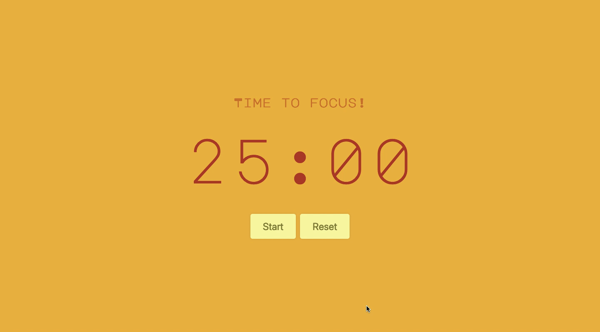
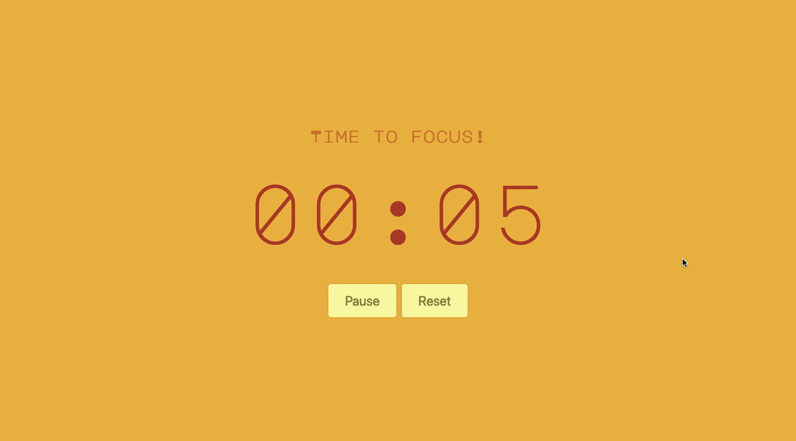
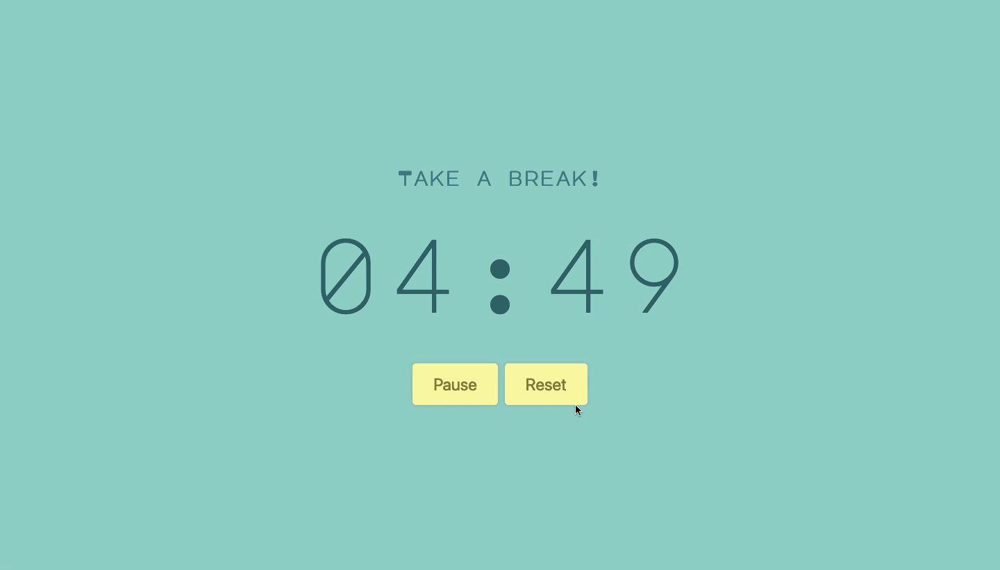

# Pomodoro

Pomodoro productivity timer
[Try my app for yourself!](http://focus-timer.today/)

### The Pomodoro Technique

[The Pomodoro Technique](https://francescocirillo.com/pages/pomodoro-technique) is a time management method developed by Francesco Cirillo in the late 1980s. You begin by choosing a task that you'd like to get done. Set your timer for 25 minutes. Commit to spending 25 minutes on this task without interruption. When the timer rings, you have completed one "pomodoro". Congratulations! Give yourself a short break to breathe, meditate, grab a cup of coffee, go for a short walk or do something else relaxing (i.e., not work-related). Once you’ve completed four pomodoros, you can take a longer break.

### My Productivity Timer App

My web app makes it easy for anyone to use the Pomodoro method.

Simply start the timer and begin your first pomodoro. You can pause the timer at any time.

Once you have completed a pomodoro, a gentle alert will sound when it is time to take a break.

You can also reset the timer from the beginning of the cylce at any time.

I hope you enjoy using my app, and happy pomodoro-ing!
